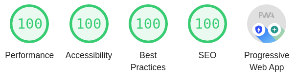

# Angular Bazel Starter

## Features

- Development server with hot reload
- Lazy Loading
- Progressive Web App
- Service Worker
- Server Side Rendering
- Sass for styling
- Perfect Lighthouse score
- Environments
- Shared libraries

  

## Commands

- Setup project: `yarn`
- Start development server: `yarn dev`
- Start normal web server: `yarn app`
- Start PWA web server: `yarn pwa`
- Start Node.Js with server side rendering: `yarn ssr`

## TODO

- Unit Tests
- Integration Tests
- Deployment to Kubernetes
- Deployment to Heroku (also for demo)
- `ts_devserver` with Socket.IO
- Service Worker Updates
- Differential Loading
- NgRx
- Simple Backend
